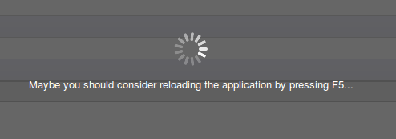

layout: false
class: center, middle, inverse

# A Jobs Queue for processing tasks asynchronously

<!--
Job patterns: 
  Try or delay: try: call() except: call.delay(); 
  Fanout: "batch" job that spawn other jobs
-->

---
background-image: url(camptocamp.png)
# About us

## Guewen Baconnier
* Developer @ Camptocamp
* OCA committer, OCA Delegate
* Connector Team leader
* Twitter @guewenb

## Leonardo Pistone
* Developer @ Camptocamp
* OCA committer, OCA Delegate
* Twitter @lepistone

---
class: center, middle
# Computers are slow!
--

# Humans want them to be fast!


---
class: center, middle, inverse

# The problem

---
name: why-sequence
background-image: url(sequence_jobs.svg)

---
class: center, middle


# Loading...

---
class: center, middle


# Still loading...

---
class: center, middle


# Still loading... Please be patient.

---
class: center, middle


# Don't leave yet, it's still loading

---
class: center, middle


# You may not believe it, but the application is actually loading...

---
class: center, middle


# Take a minute to get a coffee, because it's loading...

---
class: center, middle



# Come on...

---
class: center, middle, inverse

# Better

---
name: why-sequence2
background-image: url(sequence_jobs2.svg)

---
class: center, middle, inverse
.connector-word-title[Connector]

???

How do we queue in Odoo then?
Connector is an OCA addons.

Used in many addons.
Magento. Prestashop. Various connectors.
But also some which are not connectors, addons that use only the jobs queue.
Example: module to import large CSV files in jobs, chunk by chunk.

Framework to build connectors.
But not limited to connectors.

---
# Queue it!

Dependency on .connector-word[connector]

Install your addon in the connector:

--

Declare a job:

```python
from openerp.addons.connector.queue.job import job

@job
def a_heavy_task(session, model_name, record_id):
    # do an heavy task on record_id of model_name
```

--
Delay a job:

```python
session = ConnectorSession.from_env(self.env)
a_heavy_task.delay(session, 'res.partner', 1)
```


???

---

# Dequeue it!

Start the server with:

```python
ODOO_CONNECTOR_CHANNELS=root:4 ./openerp-server --load=web,connector
```

???

Where workers > 1 and > the number next to root, so > 4.
But what are these channels?

---
class: inverse, center, middle

# Channels


---

background-image: url(channels_simple.svg)

---
class: inverse, center, middle

# Properties

---

# Priority

```python
a_task.delay(session, 1, priority=10)
a_task.delay(session, 2, priority=100)
```

???
add a schema?
tell use cases (fanout jobs, import of trees, ...)

---

# ETA

```python
a_task.delay(session, 1, eta=60*60)
a_task.delay(session, 2, eta=datetime.now() + timedelta(days=1))
```

???
add a schema?

---

# Retries

```python
a_task.delay(session, 1, max_retries=3)
```
--
# Invoke a retry


```python
@job
def a_task(session, args):
    try:
        do_operation()
    except (socket.gaierror, socket.error, socket.timeout) as err:                                                                                              
        raise RetryableError(                                                                                                                            
            'A network error caused the failure of the job: '                                                                                                   
            '%s' % err)
```

???

RetryableError or subclass

---
class: inverse, center, middle
# Best Practices
---

layout: false
.left-column[
  ## Outdating
]
.right-column[
Data in jobs can become outdated.

No:
```python
@job
def example(session, record_id, vals):
    export(record_id, vals)
```

Yes:
```python
 @job
 def example(session, record_id):
*    export(session.env['model'].browse(record_id))
```

]

---

.left-column[
  ## Outdating
  ## Existence
]

.right-column[
A job can refer to a record which has been deleted.
Always check if it still exists.

No:
```python
@job
def example(session, record_id):
    export(session.env['model'].browse(record_id))
```

Yes:
```python
 @job
 def example(session, record_id):
     record = session.env['model'].browse(record_id)
*    if record.exists():
         export(record)
```

]

---

.left-column[
  ## Outdating
  ## Existence
  ## Idempotence
]

.right-column[
A job should, when possible, produce the same result when executed several
times.

No:
```python
@job
def example(session, record_id):
    export(session.env['model'].browse(record_id))
```

Yes:
```python
 @job
 def example(session, record_id):
     record = session.env['model'].browse(record_id)
     if record.exists():
*        if not record.exported:
             export(session.env['model'].browse(record_id))
```

]
---
class: inverse, center, middle

# Useful Patterns

---
# Fanout Job

A job generating other jobs.

```python
@job
def import_file(session, filepath):
    with open(filepath) as f:
        for line in f:
            import_line.delay(session, line)
```

---
# Try or delay

If an operation failed, try it later.

```python
@job
def do_operation(session, args):
    # work

try:
    do_operation(session, args)
except UserError:
    do_operation.delay(session, args)
```


---
class: center
background-image: url(all_sponsors.png)

# OCA Booth

